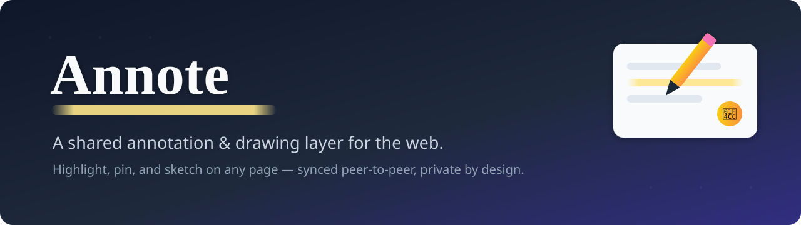
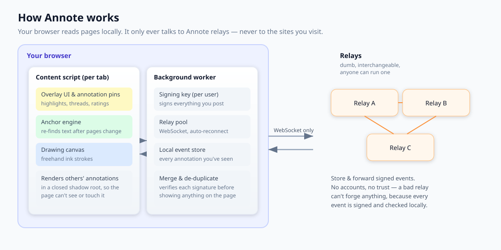

<p align="center">
  
</p>

<h1 align="center">Annote</h1>

<p align="center">
  <strong>A shared annotation &amp; drawing layer for the web.</strong><br>
  Highlight text, pin comments, and sketch on any page — synced peer-to-peer, private by design.
</p>

<p align="center">
  
  
  
  
</p>

---

## What is Annote?

Annote is a browser extension that turns any web page into a shared canvas. Select a passage and leave a comment on it, drop a pin anywhere, attach a picture, or draw freehand — then see what other people left on the same page. Annotations re-anchor themselves intelligently when a page's content shifts, so your notes stay put even as the web changes underneath them.

There's no central server and no account. Contributions travel over lightweight, interchangeable **relays** that anyone can run, and every contribution is signed so it can't be forged or tampered with in transit.

> **Privacy first:** Annote never talks to the sites you visit. It reads a page only locally, to figure out where an annotation belongs. All network traffic goes exclusively to Annote relays.

---

## Features

- **Text highlighting** — select any text and attach a comment to that exact passage.
- **Pins anywhere** — drop a 📌 comment, 🖼 picture, or ✏️ freehand drawing at any point on a page.
- **Smart re-anchoring** — a five-layer resolver re-finds your annotation after a page changes (exact match → fuzzy match → structural fingerprint → scroll position → orphaned tray).
- **Threaded replies** — comment on, agree with, or push back on any annotation, and upvote the good ones.
- **Page sidebar** — see every annotation on the current page, surface orphaned ones, and give the page a 1–5★ rating.
- **Peer-to-peer sync** — no central database; contributions flow through relays and merge locally.
- **Private by design** — the visited URL never leaves your machine in plaintext, and the overlay lives in a closed shadow root the page can't see or touch.

---

## How it works

<p align="center">
  
</p>

Three moving parts:

1. **Extension (Manifest V3)** — renders the overlay, computes anchors, and signs everything you post.
2. **Relays** — dumb store-and-forward servers for signed events, filterable by page. Anyone can run one; clients connect to several; no relay is trusted.
3. **Local event log** — every client keeps and verifies its own copy of the events it has seen, so any one honest relay is enough to stay in sync.

See [`DESIGN.md`](DESIGN.md) for the full architecture.

---

## Quick start

### 1. Run a relay

Zero dependencies — needs only Node 20+.

```bash
cd relay
npm start            # ws://127.0.0.1:8787 (the extension's default)
# multi-relay mesh:  node server.js --port 8788 --peers ws://127.0.0.1:8787
```

### 2. Load the extension

**Chrome / Edge / Brave**
1. Go to `chrome://extensions`
2. Enable **Developer mode** (top-right)
3. Click **Load unpacked** and select the `extension/` folder

**Firefox**
1. Go to `about:debugging#/runtime/this-firefox`
2. Click **Load Temporary Add-on…** and select `extension/manifest.json`
3. If pins don't appear, open `about:addons` → Annote → Permissions → enable *"Access your data for all websites"* (Firefox MV3 treats host permissions as opt-in)

### 3. Use it

On any page, use the bottom-right toolbar:

| Action | How |
| --- | --- |
| Comment on a passage | Select text → **Annote ✎** bubble |
| Drop a pin | Click 📌 and place it anywhere |
| Attach a picture | Click 🖼 |
| Draw freehand | Click ✏️ |
| See everything on the page | Open the ☰ sidebar (annotations, orphaned notes, page rating) |
| Read &amp; reply | Click any pin to read, upvote (▲), and reply |

---

## Two-user demo on one machine

Run the relay, load the extension in two separate browser profiles, and open the same page in both. Annotate in one window — the pin appears in the other. Reply and upvote, and watch both windows stay in sync.

---

## Testing

```bash
node test.js         # core logic tests (needs Node 20+)
```

---

## Project layout

```
annote/
├── extension/       # the browser extension (Manifest V3)
│   ├── manifest.json
│   ├── background.js    # background worker: signing, relay pool, event store
│   ├── content.js       # overlay UI, anchor engine, drawing canvas
│   ├── shared.js        # shared helpers
│   ├── popup.html/js    # toolbar popup
├── relay/           # zero-dependency WebSocket relay (Node 20+)
│   ├── server.js
│   └── wsmini.js
├── DESIGN.md        # architecture & design notes
└── test.js          # test suite
```

---

## Roadmap

- [ ] Relay gossip mesh for better propagation
- [ ] Persistent local storage (IndexedDB)
- [ ] Tags &amp; full-text search across annotations
- [ ] Encrypted direct messages between authors
- [ ] Pure peer-to-peer option (WebRTC between co-visitors)

---

## License

MIT
